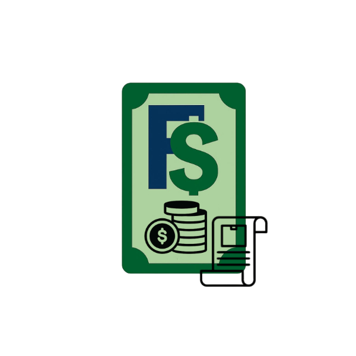

<div align="center">
  <a href="[https://github.com/manojrajm/finsnap](https://github.com/manojrajm/finsnap?tab=readme-ov-file)">
     
    
  </a>
  <h1>FinSnap</h1>
</div>


## Overview
**FinSnap** is a **Billing and Invoice Management System** designed for small and medium-sized businesses. It provides a professional, user-friendly interface for managing invoices, tracking payments, and visualizing financial data in real time. Built with **React** and **Firebase**, FinSnap ensures fast and reliable performance.


## Features
- **Dashboard Overview**:
  - Displays total payments, recent invoices, and invoice counts.
  - Interactive cards with hover effects for key metrics.
- **Invoice Management**:
  - Create, view, and manage invoices.
  - Real-time updates with Firebase Firestore.
- **Dynamic Navigation**:
  - Seamless transitions between Billing Form, Invoice Management, and Home views.
- **Responsive Design**:
  - Optimized for mobile and desktop screens.
- **Modern UI**:
  - Stylish components with smooth animations and shadow effects.
  ----

## Tech Stack
- **Frontend**: React, JSX
- **Styling**: Custom CSS with modern design principles
- **Backend**: Firebase Firestore (database)
- **Deployment**: Github and Netify

## Installation & Setup
### Prerequisites
Ensure you have **Node.js** installed. You also need a Firebase project set up.

### Clone the Repository
```sh
git clone https://github.com/manojrajm/finsnap.git

cd finsnap
```

### Install Dependencies
```sh
npm install
```

### Configure Firebase
1. Create a **Firebase Project** at [Firebase Console](https://console.firebase.google.com/)
2. Add a **Firestore Database** and **Storage**
3. Generate Firebase config and add it in `src/firebase/FirebaseConfig.js`

Example `FirebaseConfig.js`:
```js
import { initializeApp } from "firebase/app";
import { getFirestore } from "firebase/firestore";
import { getStorage } from "firebase/storage";

const firebaseConfig = {
  apiKey: "YOUR_API_KEY",
  authDomain: "YOUR_AUTH_DOMAIN",
  projectId: "YOUR_PROJECT_ID",
  storageBucket: "YOUR_STORAGE_BUCKET",
  messagingSenderId: "YOUR_MESSAGING_SENDER_ID",
  appId: "YOUR_APP_ID"
};

const app = initializeApp(firebaseConfig);
export const db = getFirestore(app);
export const storage = getStorage(app);
```

### Run the Application
```sh
npm start
```

## Usage
1. **Billing Form**: Navigate to the BillingForm view to add new invoices.
2. **Dashboard**: View real-time statistics on payments and invoices.
3. **Invoices**: Explore recent invoices and their statuses.


4. **Download Report**: Click the **Download Pdf** button to save booking details.

## Project Structure
```
/src
  ├── components/   # Reusable UI Components
  ├── firebase/     # Firebase configuration
  ├── pages/        # Main app pages
  ├── styles/       # Global styles
  ├── App.js        # Entry point
  ├── index.js      # Renders the app
```

## Deployment
You can deploy the project using **Vercel**, **Netlify**, or **Firebase Hosting**.

Example (Firebase Hosting):
```sh
npm run build
firebase deploy
```

## Future Improvements
- Payment Gateway Integration
- Advanced Reporting & Analytics


---


